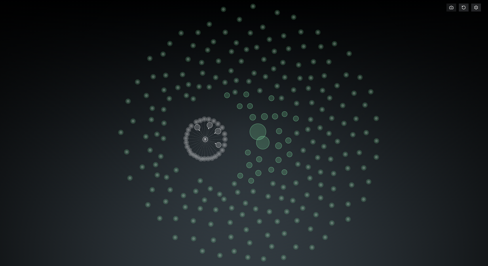

# Usage

### Scanning the Wallet Activity

To perform a basic scan of a token you should open the chat with [@is\_dev\_selling\_bot](https://t.me/is\_dev\_selling\_bot) and send a CA to the bot. The DS Bot should respond with the following message:

<figure><figcaption>
Processing a request. (The request has been sent to a server and is now waiting for a reply)
</figcaption></figure>

After some time passes _(\~ A few seconds - a few minutes)_ DSB should respond with one out of two options:

1. ✅ [The successful Scan Report](reading-the-data/successful-scan-reports.md)
2. 🔫 [The successful Sniper Report](reading-the-data/successful-sniper-repors.md)
3. 🚨 [An error](reading-the-data/errors.md)

